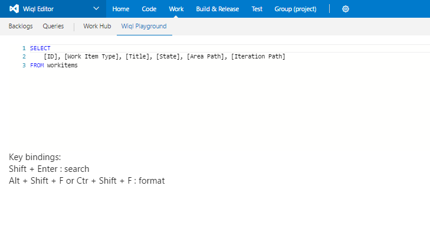
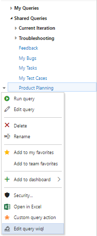
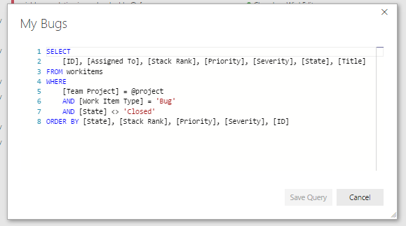

Search work items with a the expressiveness of the work item query language.

Explore the wiql syntax on the wiql playground

Use the wiql editor to modify existing queries

Save changes to the query when finished.

 

# Change Log
#### v1.0.1
Initial Release