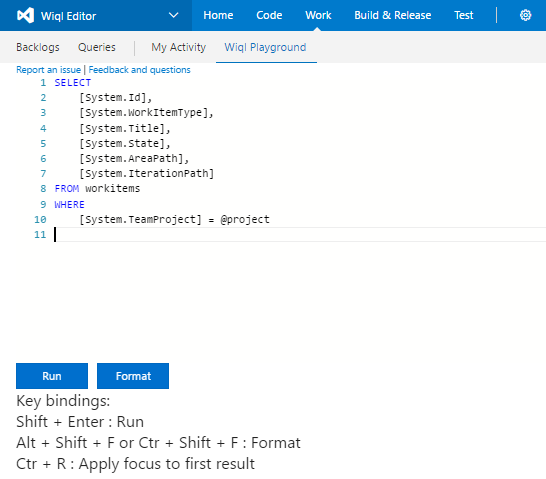
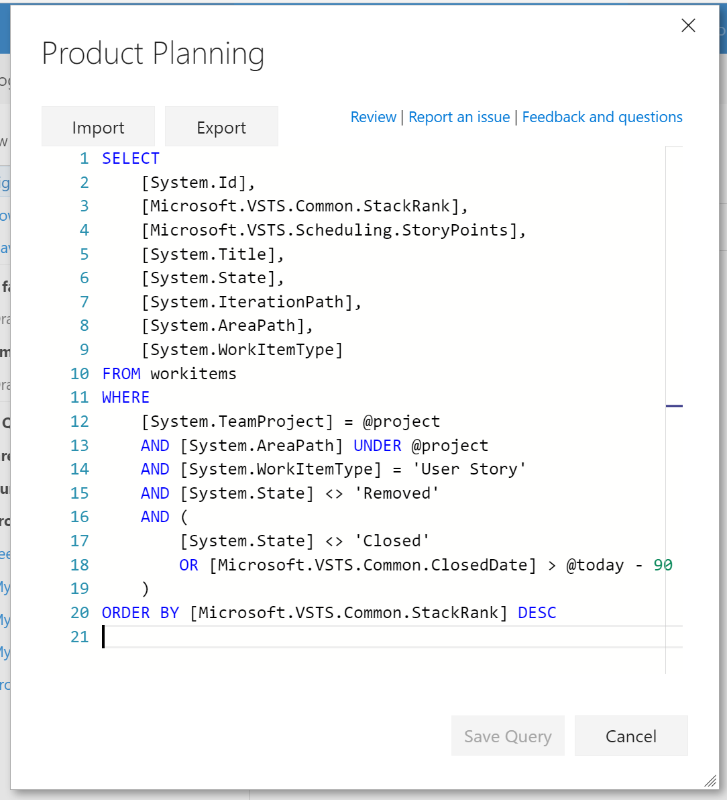

Search work items with a the expressiveness of the work item query language.

Explore the wiql syntax on the wiql playground  

Use the wiql editor to modify existing queries

Save changes to the query when finished.

 

Be sure to [send feedback](wiqleditor@microsoft.com)

# Change Log
(03/26/17) 1.6.22 Allowed operator issue, block field suggestions when not allowed, dialog sizing  
(03/26/17) 1.6.16 Decrease loading times  
(03/19/17) 1.6.1 Completion for: workitemtypes, states, iteration paths, area paths, tags  
Typechecking comparison operator completion  
(03/16/17) 1.5.6 Updating wiq formatting  
(03/15/17) 1.5.1 Adds import and export buttons to editor  
Value completion of system identity fields  
Only show valid field types for field to field comparisons  
Allow saving of new queries  
(02/10/17) 1.4.14 Adds missing 'Ever' field operator  
(02/09/17) 1.4.8 Fixes link bug in older tfs installations  
Updates keybindings on results pane  
(02/08/17) 1.4.1 Show type of variables and fields on hover  
Changes url generation  
(01/30/17) 1.3.1 Removing noise from autocomplete  
(01/08/17) 1.2.1 Adds playground buttons  
Feedback links  
More syntax checking in link queries  
(12/25/16) 1.1.1 Adds support for one hop and recursive query types  
(12/17/16) 1.0.81 Patches bug type checking  
(12/14/16) 1.0.78 Patches on prem bug saving queries  
(12/08/16) 1.0.5 Changes syntax highlighting. Disclaimer about query types that are supported.  
(12/07/16) 1.0.1 Initial Release
